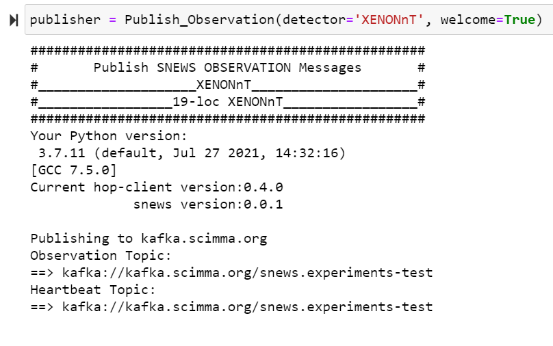
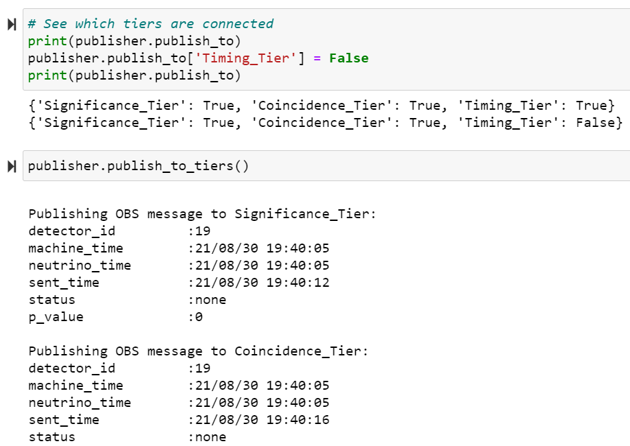

# SNEWS hop-comms

created: August 2021  

This repo contains scripts that allow for experiments and the snews network to _easily_ publish and subscribe to different topics.  

## `hop_pub`
Contains the publication class. It has `Publish_Observation`, `Publish_Heartbeat` and `Publish_Alert` submodules.  
See [this notebook](dev-testing.ipynb) for a demonstration of each method. 
Observation and Heartbeat modules can be initialized with a detector name, in which case the object knows detectors ID and location. Detector properties can be edited, and new detectors can be added [here](./auxiliary/make_detector_file.py).

### `Publish_Observation` 
Can be initialized with a message, detector name and an environment file. If nothing is given it sets a `'TEST'` detector with a default environment and a default observation message.  

It can read a message from a json file when a string is provided. If a dictionary is given, it merges this input with the default dictionary. This ensures that some fields always exists. The 'sent_time' is automatically updated for each call.  
The message can be displayed and modified before it is actually published with `.publish()` method. 
Currently, it is not clear how we want to handle different tiers. We can either 
-	publish a different message to each tier containing only the relevant keys for that tier. Or,
-	make a single message depending on the experiments selection and publish that single message. Later, we parse this.

The current script implements the former. 

### `Publish_Heartbeat`
